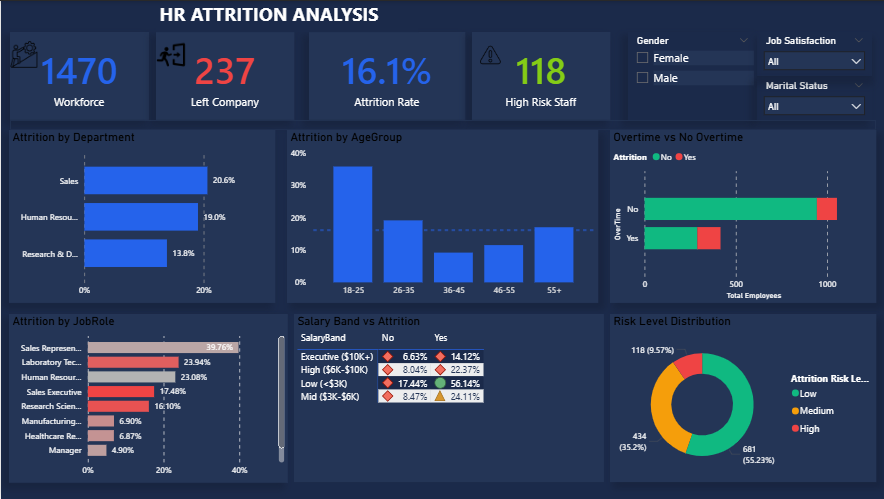

# 🧠 HR Attrition & Employee Retention Analysis

## 🛠️ Tech Stack

---

## 📌 Project Overview

This project delivers a full-stack HR analytics solution built on the IBM HR Analytics dataset — 1,470 employee records across 35 features. The goal was to move beyond descriptive reporting and answer one central business question:

> **Does overtime correlate more strongly with attrition than salary?**

The project covers the complete analyst workflow: raw data ingestion and cleaning in SQL Server, exploratory data analysis and statistical correlation testing in Python, and an interactive retention risk dashboard built in Power BI.

> **Dataset:** [IBM HR Analytics Employee Attrition & Performance — Kaggle](https://www.kaggle.com/datasets/pavansubhasht/ibm-hr-analytics-attrition-dataset)

---

## 🛠️ Tools & Technologies

- **SQL Server:** Staging table creation, data quality audits, feature engineering, and risk score calculation.
- **Python (Pandas, NumPy, SciPy, Matplotlib, Seaborn):** Exploratory data analysis, point-biserial correlation testing, and attrition driver visualization.
- **Power BI Desktop:** Data modeling, DAX measure development, and interactive dashboard with cross-filtering and What-If analysis.

---

## 🧼 Data Cleaning & Feature Engineering (SQL)

The raw CSV was loaded into a staging table (`hr_raw`) and fully transformed into a clean production table (`hr_clean`). Key steps included:

- **Null & Duplicate Audit:** Confirmed zero nulls and zero duplicate EmployeeNumbers across all 1,470 records.
- **Constant Column Removal:** Dropped `StandardHours`, `EmployeeCount`, and `Over18` — all single-value columns with no analytical value.
- **AgeGroup Bands:** Bucketed employee ages into five groups (18-25, 26-35, 36-45, 46-55, 55+) for demographic analysis.
- **SalaryBand Engineering:** Mapped `MonthlyIncome` into four quartile-based bands (Low <$3K, Mid $3K-$6K, High $6K-$10K, Executive $10K+) to normalize compensation comparisons.
- **Binary Flags:** Converted `Attrition` and `OverTime` from Yes/No strings to integer flags (1/0) for clean DAX aggregation.
- **Satisfaction Labels:** Mapped integer satisfaction scores (1-4) to human-readable labels for readable visual axes.
- **Attrition Risk Score:** Built a weighted composite score (max 13 points) combining seven attrition drivers — overtime carries the highest weight (3pts) based on correlation findings.
- **Risk Level Segmentation:** Classified every active employee as High (≥7), Medium (≥4), or Low risk based on their composite score.

---

## 📊 Key DAX Measures

Custom measures were written to power every visual and insight in the dashboard:

- **Attrition Rate:** `DIVIDE([Total Attritions], [Total Employees], 0)`
- **Overtime Attrition Rate:** Filtered attrition rate for `OverTime = "Yes"` vs `"No"` to surface the multiplier effect.
- **OT Attrition Multiplier:** Ratio of overtime attrition rate to non-overtime rate — confirms the 3× signal.
- **Income Gap:** Difference in average monthly income between employees who left and those who stayed.
- **High Risk Count & %:** Active employees flagged as High risk by the composite score.
- **Projected Attrition (What-If):** Dynamic measure using a numeric parameter to model how attrition changes if overtime is reduced by X%.

---

## 📈 Key Findings

| Finding | Result |
|---|---|
| Overall attrition rate | **16.1%** — 237 of 1,470 employees left |
| Overtime attrition rate | **~30.5%** — OT workers leave at 3× the baseline rate |
| Non-overtime attrition rate | **~10.4%** — baseline without overtime pressure |
| Answer to central question | **YES** — OverTime (r ≈ +0.25) correlates more strongly with attrition than MonthlyIncome (r ≈ −0.16) |
| Highest-attrition department | **Sales (~20.6%)** leads all departments |
| Highest-attrition role | **Sales Representative (~40%)** — highest single-role rate |
| Salary finding | Low salary band (<$3K) has ~28% attrition vs Executive band (~5%) |
| Highest-risk cohort | Overtime=Yes + Low Salary + Low Satisfaction → **~55% attrition rate** |

---

## 📉 Dashboard Visuals

The single-page dashboard covers:

- **KPI Cards** — Total workforce, attrition count, attrition rate, high-risk active staff
- **Attrition by Department** — Horizontal bar chart sorted by rate
- **Attrition by Age Group** — Column chart with overall rate constant line
- **Overtime vs No Overtime** — Stacked bar showing the attrition split visually
- **Salary Band vs Attrition Heatmap** — Matrix with conditional color scale (white → red)
- **Attrition by Job Role** — Sorted bar with red-scale conditional formatting
- **Risk Level Distribution** — Donut chart: High / Medium / Low active employees
- **What-If Slicer** — Projects attrition rate reduction if overtime is cut by X%

---

## 🚀 Recommendations

- **Target overtime reduction** in Sales and low-income roles first — the highest-risk cohort concentrates there.
- **Implement satisfaction interventions** for employees scoring 1-2 on JobSatisfaction and WorkLifeBalance, particularly in the 0-2 year tenure window.
- **Review compensation** for the Low (<$3K) salary band — they carry disproportionate attrition risk independent of overtime status.
- **Monitor the High-risk flag list** quarterly — the composite score surfaces flight risks before they resign, giving HR a proactive intervention window.

---

## 📂 Project Structure
